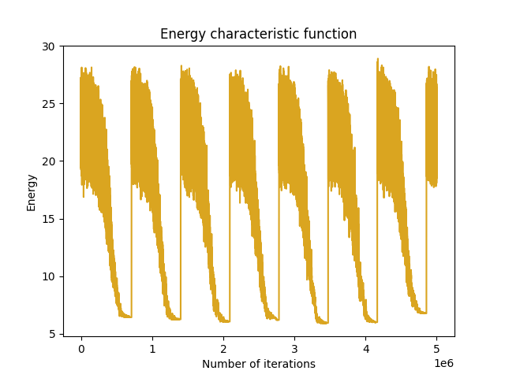
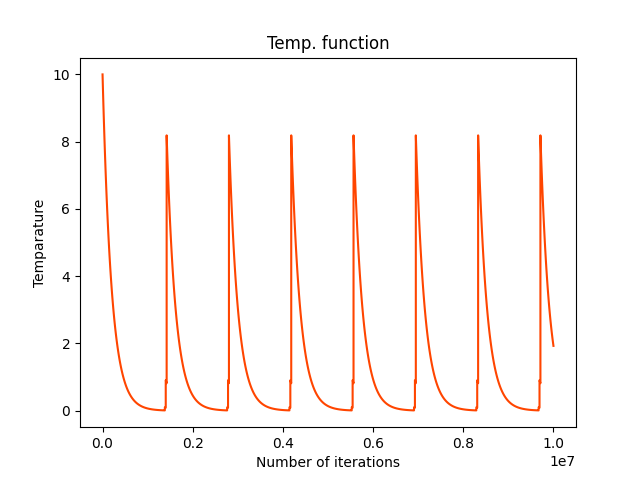
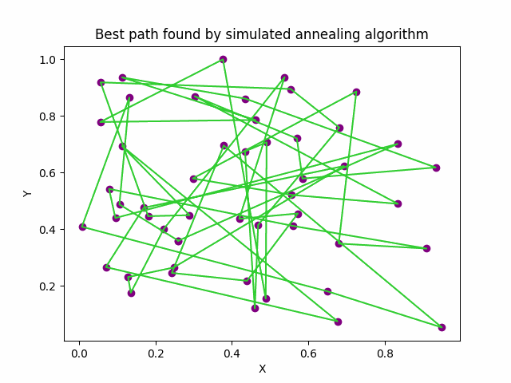
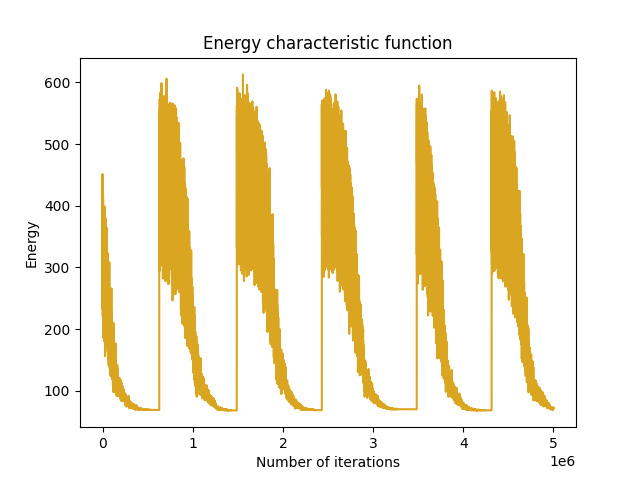
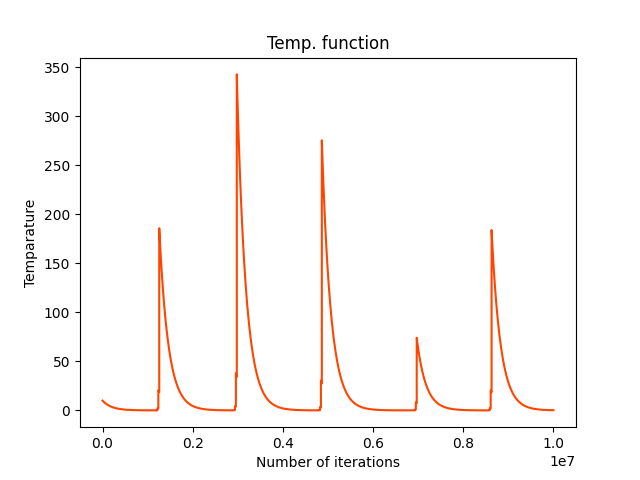
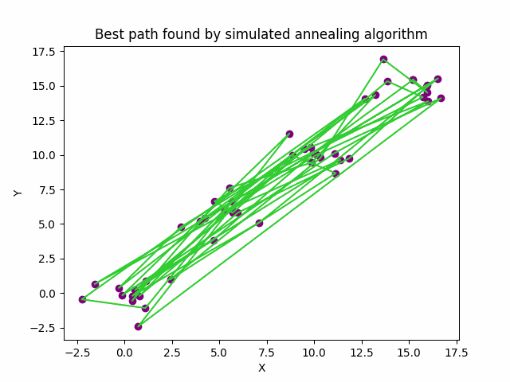
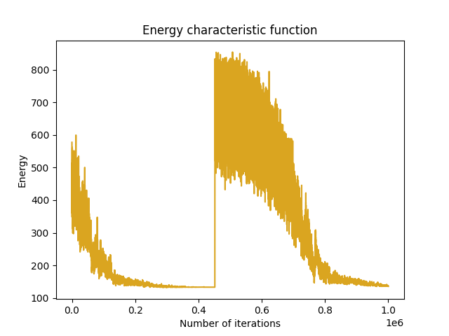
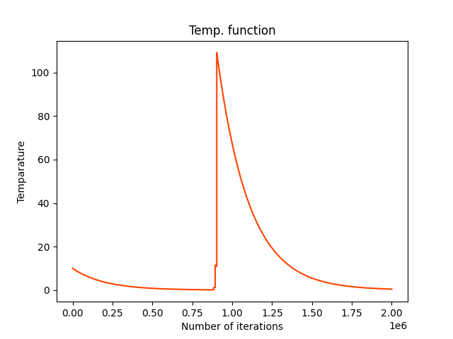
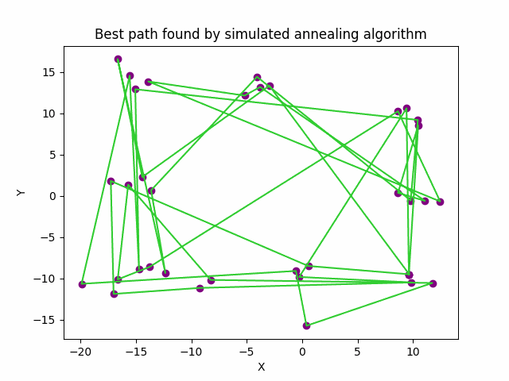

Solving TSP (Traveling-Salesman-Problem) using simulated anealing algorithm:

 
What is simulated annealing?

CLICK HERE TO FIND OUT -> <a href="annealing.md" style="color: orange;text-decoration: underline;">SIMULATED ANEALING</a>

 

REAL LIFE USE CASE OF TSP -> <a href="europe_trip.md" style="color: orange;text-decoration: underline;">EUROPE TRIP</a>

 
We will consider 3 types of generating points:
 

<ol>
<li>Using random.uniform() function</li>
<li>Using random.multivariate_normal() function</li>
<li>Randomly generating points in 9 clusters</li>
</ol> 

 

Energy function is defined as the total distance of the route. The algorithm will try to minimize this energy function.

Multiple highs and lows in the energy and temperature plot are due to the reheat functionality. 

 

**Using random.uniform() function:**

This is the energy plot for the solution:

Temperature plot for the solution:

Final solution:

**Using random.multivariate_normal function:**

 This is the energy plot for the solution:

Temperature plot for the solution:

Final solution:

**Randomly generating points in 9 clusters**

 This is the energy plot for the solution:

Temperature plot for the solution:

Final solution:

