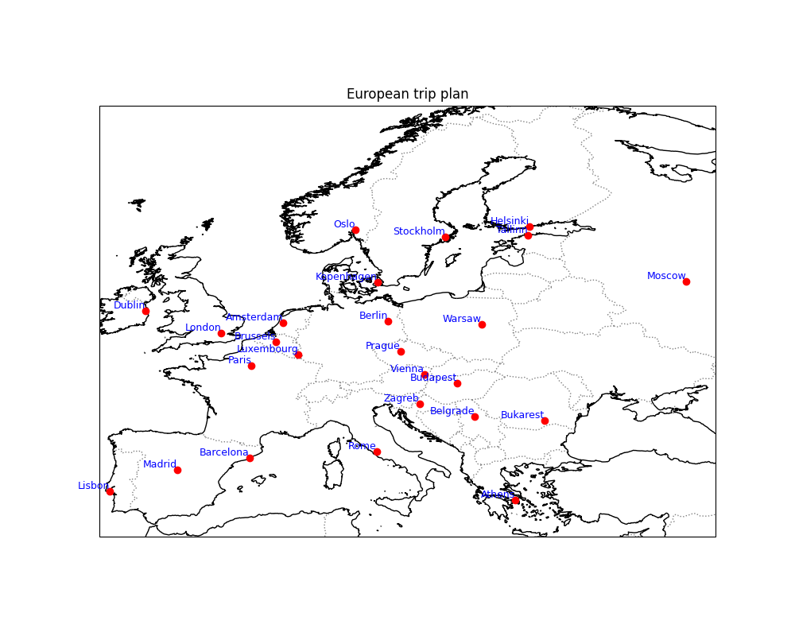
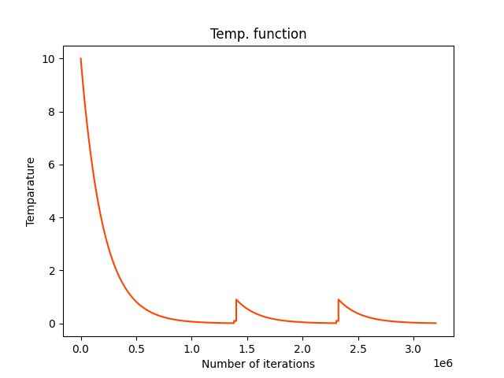
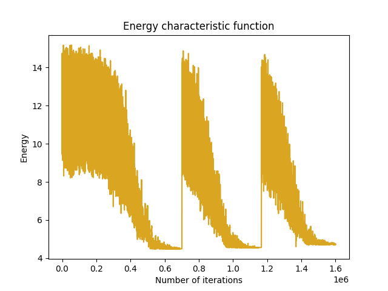
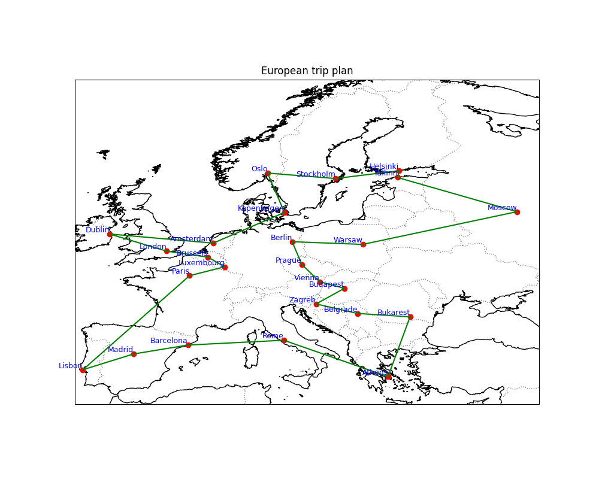

<font size="6">
Practical Example: Trip to Europe
</font>
<br>
<font size="2">
<a href="README.md">CLICK HERE TO RETURN TO MAIN PAGE</a>
</font>
<br>
<font size="3">
Let's say you won a trip to visit given 25 cities in Europe. You have limited time and budget, so you want to find the shortest possible route that visits each city exactly once and returns to the starting city. This is a classic example of the Traveling Salesman Problem (TSP).
</font>
<br>

This is the map of the cities you want to visit:


The cities are represented by the numbers from 0 to 24. The distance between each pair of cities is given by the Euclidean distance between their coordinates. The coordinates of the cities are given in code:
```python
europe_capitals = {
        "Berlin": (52.5200, 13.4050),
        "Paris": (48.8566, 2.3522),
        "London": (51.5074, -0.1278),
        "Barcelona": (41.3851, 2.1734),        
        "Vienna": (48.2082, 16.3738),
        "Amsterdam": (52.3676, 4.9041),
        "Kopenhagen": (55.6761, 12.5683),
        "Zagreb": (45.8150, 15.9819),
        "Tallinn": (59.4370, 24.7536),   
        "Rome": (41.9028, 12.4964),
        "Madrid": (40.4168, -3.7038),
        "Warsaw": (52.2297, 21.0122),
        "Stockholm": (59.3293, 18.0686),
        "Lisbon": (38.7223, -9.1393),
        "Prague": (50.0755, 14.4378),
        "Bukarest": (44.4268, 26.1025),
        "Athens": (37.9838, 23.7275),
        "Budapest": (47.4979, 19.0402),
        "Dublin": (53.3498, -6.2603),
        "Helsinki": (60.1695, 24.9354),
        "Brussels": (50.8503, 4.3517),
        "Luxembourg": (49.8153, 6.1296),
        "Oslo": (59.9139, 10.7522), 
        "Moscow": (55.7558, 37.6176),
        "Belgrade": (44.7866, 20.4489),
    }
```

Now we will solve the TSP using simulated annealing algorithm. The algorithm starts with a random solution and iteratively improves it by making small changes to the solution. The key idea is to accept worse solutions with a certain probability, which allows the algorithm to escape local optima and explore the solution space more effectively.
<br>
Probability of accepting a worse solution depends on the temperature parameter, which is gradually decreased during the optimization process.
<br>

Heres the temparture plot for the solution:




Energy function is defined as the total distance of the route. The algorithm will try to minimize this energy function. This is the energy plot for the solution:



The algorithm converges to a near-optimal solution after a few iterations. This is the final route that the algorithm found:




<a href="README.md">CLICK HERE TO RETURN TO MAIN PAGE</a>
